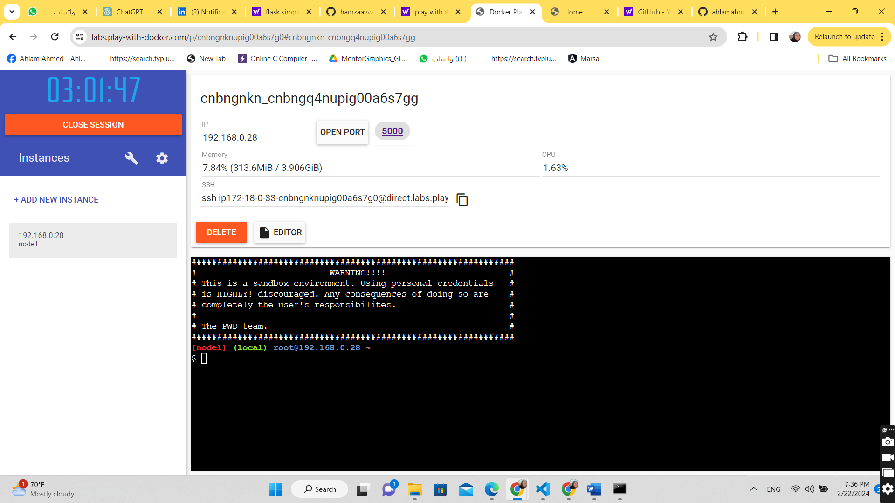
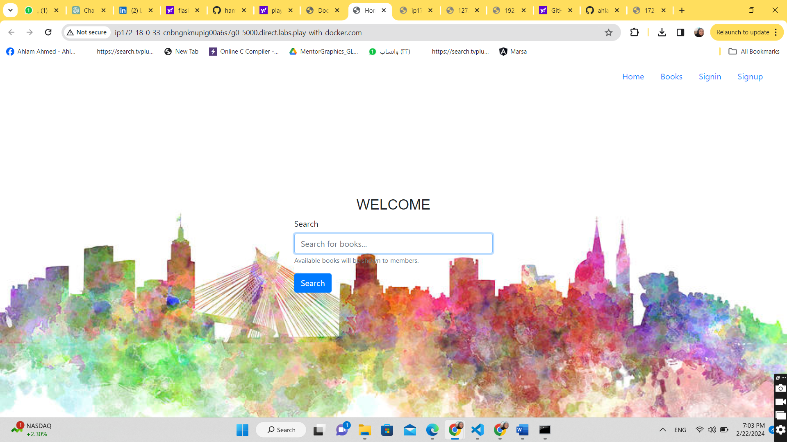

I use this code to deply flask app on Play with docker node <br>
https://github.com/hamzaavvan/library-management-system <br>
STEPS:-<br>
1-start play with docker server <br>
2-creat node <br>
2-ssh to this node it using the provided ssh command (optional to make copy and past easy)<br>
3-clone the code 

```bash
git clone https://github.com/hamzaavvan/library-management-system.git 
```
4-I creat my own docker file <br>
5-build the docker image 

```bash
 docker build -t my-flask-app .
```
6-run container from this image 

```bash
 docker run -p 5000:5000 my-flask-app
```
7-once the container run the flask server start<br>
8-open port 5000 on the Play with docker node <br>

6-expose the image using this port <br>
the websit use the node url and 5000 port to open it on your browser


